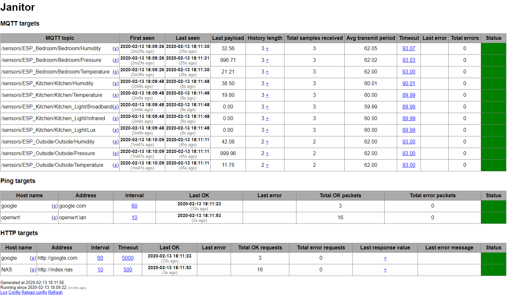

# janitor
## Objective
Janitor is a standalone tool that monitors the availability of your IOT devices and alerts you in case a device goes missing or stops transmitting data. This is particulary useful if you have many sensors, possibly with unstable hardware or connection, so you can take action in case of any issues and monitor the stability of your devices.

Janitor does not aim to implement any additional functionalities, therefore is not an alternative to your other home automation software (e.g. HASS). Focusing on solely this functionality will enable to keep this tool simple and efficient.

Janitor currently supports the following monitoring methods:
* **MQTT:** Janitor will subscribe to predefined MQTT topics and monitor incoming messages. An average transmit frequency will be calculated for each channel and in case no new messages are received within this interval, Janitor will alert you (the actual threshold used is 2 times the previous average frequency). This method is particulary useful for any kind of sensors submitting data regularly via MQTT (e.g. temperature).
* **Ping:** Janitor will ping predefined hosts with a predefined frequency and will alert you in case of no reply (the actual threshold used is 2 consecutively missed pings). This method is useful for any kind of IOT devices e.g. sensors, cameras etc.

Janitor currently supports the following alert methods:
* **Telegram:** Janitor will send a message to a predefined Telegram channel.
* **Gotify:** Janitor will send a push message to Gotify.

Additionally, Janitor has a web interface where you can see the current status and historical data, remove sensors and reload the configuration file (see screenshot below).

## Screenshot

## Building and installing

Janitor is written in Go and will compile to a single standalone binary. Janitor should compile and work both on Linux and on Windows.

For compiling, first install the necessary prerequisites:

    $ go get github.com/eclipse/paho.mqtt.golang
    $ go get github.com/go-telegram-bot-api/telegram-bot-api
    $ go get gopkg.in/yaml.v2

In order to embed the HTML template in the binary, install also [packr](https://github.com/gobuffalo/packr):

    $ go get github.com/gobuffalo/packr/packr
    $ go get github.com/gobuffalo/packr

Then use the following commands to clone the repository and build the binary:

    $ git clone https://github.com/a-bali/janitor.git
    $ cd janitor
    $ packr build

This will create the standalone binary named `janitor` that you can place anywhere you like.

## Configuration and usage

For configuration, a YAML formatted file is required. Please use the [sample configuration file](config.yml) and change it according to your needs, particularly the following blocks:
* mqtt: this block defines the server and topics for MQTT monitoring (can be omitted)
* ping: this block defines the hosts for ping-based monitoring (can be omitted)
* telegram: this block defines the token and chat id for Telegram (can be omitted)
* gotify: this block defines the server and token for Gotify (can be omitted)
* pinginterval: this variable defines the frequency for ping tests in seconds
* web: this block defines the port for the built-in web server
* history: this variable defines the number of records to keep per MQTT topic
* debug: this variable enables debug mode with increased logging

Once you created a configuration file, Janitor can be launched as follows:

    $ janitor path/to/your/configfile.yml

Janitor will log to standard output. The log is viewable on the web interface as well, where you can delete monitored MQTT topics and ping hosts and reload the configuration file (e.g. if you added new topics or hosts). 

Janitor will not daemonize itself. It is recommended to create a systemd service for janitor in case you want it running continuously.

## Future plans and contributing

Janitor's objective is clear and simple: to monitor the availability and operation of IOT devices and alert in case if any issues. Any future improvements should follow this objective and thus either add new ways of monitoring, or add new ways of alerting.

Janitor is open source software and you are encouraged to send pull requests via Github that improve the software.

## License

Janitor is licensed under GPL 3.0.
